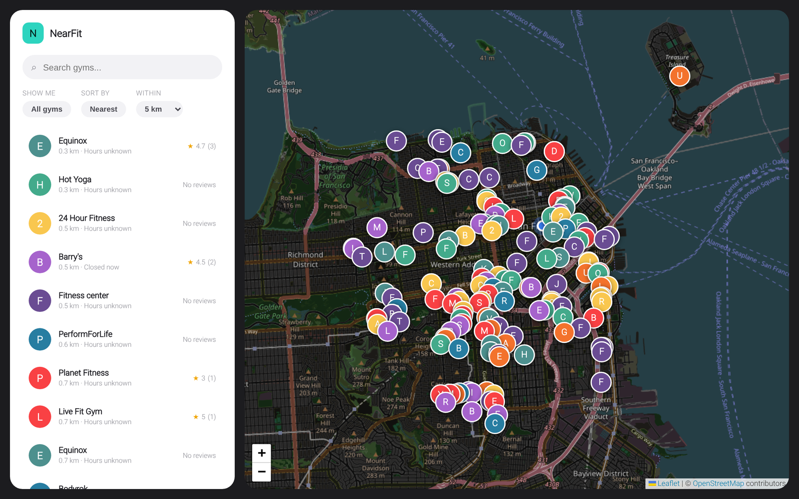
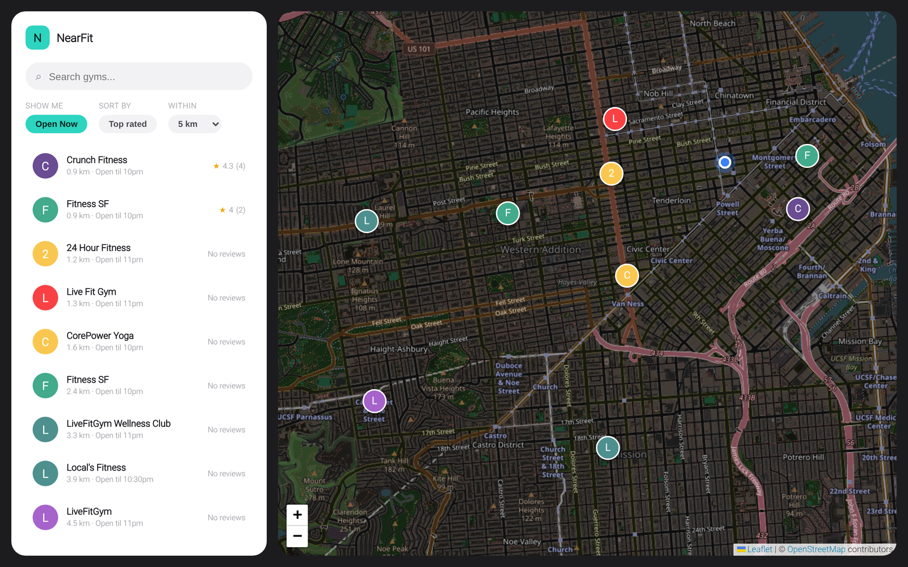
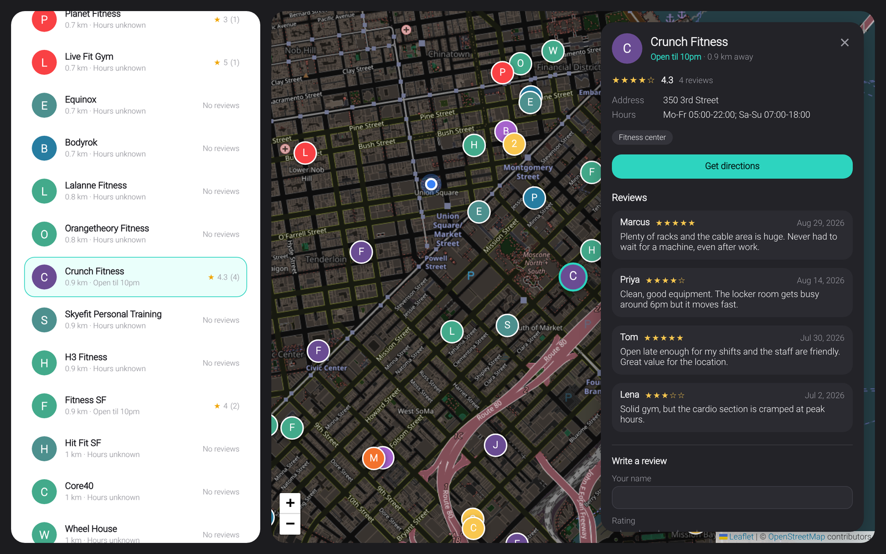
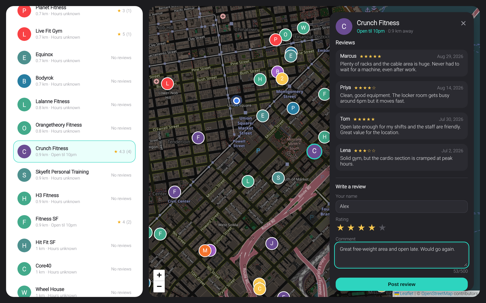
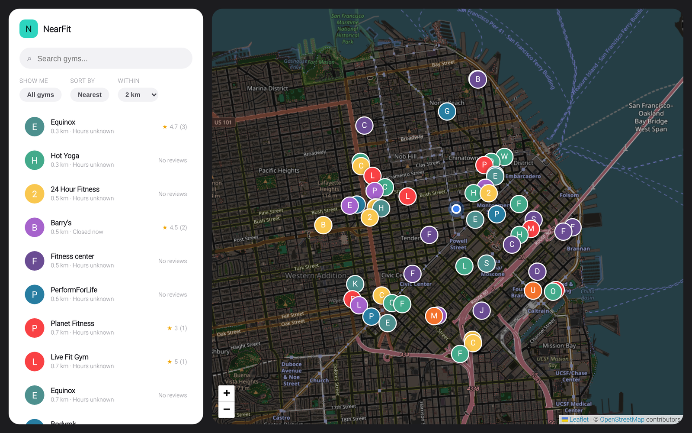
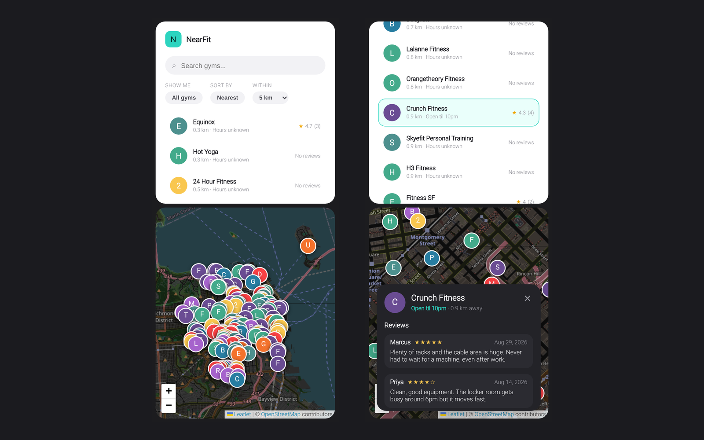

<div align="center">

# NearFit

**The nearest gym, one tap away.**

Allow location access and NearFit shows the gyms around you on a map and in
a list, with opening hours, ratings and reviews you can add to.
No account, no app to install, no scrolling through a directory to find
out what's actually close.

[](https://nodejs.org/)
[](https://expressjs.com/)
[](https://angular.dev/)
[](https://www.typescriptlang.org/)
[](https://developer.mozilla.org/docs/Web/HTML)
[](https://developer.mozilla.org/docs/Web/CSS)
[](https://www.docker.com/)
[](https://nginx.org/)
[](https://git-scm.com/)

</div>

> **Part of a bigger project.** I'm building the same app twice to compare a
> **monolithic** architecture against a **microservices** one. This repository is
> the **microservices** version: a gateway, a gym service and a review service,
> each its own Node process and container, behind an nginx frontend. The
> [monolithic version](https://github.com/bepunpun/nearfit-monolithic) serves the
> same UI and the same `/api` from a single process. See
> [Monolith vs microservices](#monolith-vs-microservices) for how they compare.

## Why NearFit

Finding a gym usually means a map app full of ads, or a directory that sorts by
whatever paid to be first. NearFit does one thing: it sorts by distance and
tells you whether the place is open right now.

- **Live data.** Gyms come from OpenStreetMap, so nothing to maintain by hand.
  If the data source is down, a small sample dataset keeps the app usable.
- **Open now.** Opening hours are parsed and a filter shows only what's open.
- **Ratings and reviews.** Read what people said and add your own, no login.
- **Independent services.** Gyms and reviews are separate services with their own
  data. If reviews go down, you can still find a gym.

## Screenshots

<table>
<tr>
<td width="50%">

**Map and list**


</td>
<td width="50%">

**Open now, top rated**


</td>
</tr>
<tr>
<td width="50%">

**Gym details and reviews**


</td>
<td width="50%">

**Write a review**


</td>
</tr>
<tr>
<td width="50%">

**Search radius**


</td>
<td width="50%">

**On mobile**


</td>
</tr>
</table>

<sub>Captured from the running `docker compose` stack with live OpenStreetMap data around San Francisco. The reviews shown are demo content. The UI is identical to the monolithic version.</sub>

## Built with


| Layer | Choice | Why |
|---|---|---|
| Gateway | Node.js + Express | One public API; composes gyms with ratings and forwards reviews |
| Gym service | Node.js + Express | Owns gym search: Overpass client, opening hours, sample data |
| Review service | Node.js + Express | Owns reviews and rating summaries |
| Frontend | Angular + TypeScript | The same app as the monolith, served by nginx |
| Map | Leaflet + OpenStreetMap tiles | Open source, no API key |
| Gym data | Overpass API (OpenStreetMap) | Live, free, worldwide |
| Storage | JSON file in a Docker volume | No database server, zero infra |
| Tests | `node:test` and Vitest | Every service and the frontend covered |
| Hosting | Docker Compose + nginx over SSH | One command brings up all four containers |

## Install it

Requires Docker with Compose v2.

```bash
git clone https://github.com/bepunpun/nearfit-microservices.git
cd nearfit-microservices

docker compose up --build       # then open http://localhost:8080
```

That's it: no database server, no API keys, no local Node needed. Only the
frontend publishes a port; the three services talk to each other on a private
Docker network. Use another port with `WEB_PORT=80 docker compose up --build`.

## Development

To work on the services without Docker, you need Node 20+ (developed on Node 24).
Run the services and the frontend in two terminals for live reload:

```bash
npm run install:all     # install every service and the frontend
npm run dev:services    # gateway :4100, gym-service :4101, review-service :4102
npm run dev:frontend    # app on http://localhost:4200, talks to the gateway on :4100
```

`npm run dev:gateway`, `dev:gym` and `dev:review` start one service each if you
would rather use a terminal per service.

### Tests

```bash
npm test               # every service (node:test) + the frontend (Vitest via `ng test`)
npm run test:services  # services only
```

The gateway tests run against fake gym and review services, so slow, broken and
missing upstreams are all covered without starting anything real.

### How it works

```
browser --> frontend (nginx)   serves the Angular app, proxies /api/* to the gateway
                |
                v
            gateway :4100  --> gym-service    :4101  --> Overpass API (OpenStreetMap)
                |
                +------------> review-service :4102  --> reviews.json (Docker volume)
```

- **A search** goes browser, nginx, gateway. The gateway asks the gym service for
  the gyms and the review service for all rating summaries **in parallel**, then
  merges them. Ratings are fetched once per search, not once per gym.
- **When something is down**, the gateway degrades instead of failing. If the
  review service is unavailable or slow (3 s timeout), searches and gym details
  still work, just without ratings, while reading or posting reviews returns a
  502. If the gym service is unavailable, gym routes return 502, or 504 on a
  timeout. `/api/health` reports each service and answers 503 when one is down.
- **Gym data** comes live from OpenStreetMap through the
  [Overpass API](https://overpass-api.de) (nodes, ways and relations tagged as
  fitness centres), cached for 5 minutes. If Overpass is unreachable the gym
  service falls back to a small sample dataset (San Francisco) and the UI says so.
- **Opening hours** are parsed from OSM `opening_hours` (weekday ranges, several
  ranges per day, overnight hours, `24/7`, `off`; public-holiday rules are
  ignored). Anything more exotic is shown as "Hours unknown". "Open now" is
  computed in the **gym service's local time zone**, so it is only accurate when
  the server and the gyms share a time zone.
- **Reviews** are stored in a JSON file owned by the review service. The tracked
  `services/review-service/src/data/reviews.seed.json` is copied to a runtime
  file on first use, and that runtime file is where new reviews go.
- **Location**: the browser's geolocation is used when allowed; otherwise the app
  falls back to downtown San Francisco and shows a notice. Geolocation needs
  HTTPS or `localhost`.

### API

The gateway is the only public API, all under `/api`. It is identical to the
monolith's.

| Method | Path | Description |
| --- | --- | --- |
| GET | `/health` | Gateway and service health (503 if a service is down) |
| GET | `/gyms/nearby?lat&lng&radius=5&openNow=false` | Gyms within `radius` km (max 25), nearest first, each with `reviewCount` / `averageRating` |
| GET | `/gyms/:id` | One gym (`osm-way-123`, `osm-node-123`, or a sample id) with its rating |
| GET | `/reviews/gym/:gymId` | Reviews for a gym (newest first), with `count` and `average` |
| POST | `/reviews` | `{ gymId, author, rating (1-5), comment }` |

The services' own endpoints are internal, reachable only on the Docker network:

| Service | Endpoints |
| --- | --- |
| gym-service | `GET /health`, `GET /gyms/nearby`, `GET /gyms/:id` |
| review-service | `GET /health`, `GET /reviews/gym/:gymId`, `GET /reviews/ratings`, `POST /reviews` |

### Configuration

| Service | Variable | Default | Purpose |
| --- | --- | --- | --- |
| gateway | `PORT` | `4100` | Port it listens on |
| gateway | `GYM_SERVICE_URL` | `http://localhost:4101` | Where the gym service is |
| gateway | `REVIEW_SERVICE_URL` | `http://localhost:4102` | Where the review service is |
| gateway | `GYM_TIMEOUT_MS` | `45000` | Longer than the gym service's two Overpass attempts |
| gateway | `REVIEW_TIMEOUT_MS` | `3000` | Ratings are optional, so keep this short |
| gym-service | `PORT` | `4101` | Port it listens on |
| gym-service | `OVERPASS_URL` | `https://overpass-api.de/api/interpreter` | Overpass endpoint |
| review-service | `PORT` | `4102` | Port it listens on |
| review-service | `REVIEWS_FILE` | `services/review-service/src/data/reviews.json` | Where reviews are stored (`/data/reviews.json` in Docker) |
| compose | `WEB_PORT` | `8080` | Host port for the frontend |

Map tiles are the standard OpenStreetMap tiles, which are fine for light use; put
your own tile provider in `frontend/src/app/components/map/map.component.ts` before
serving real traffic (see the
[tile usage policy](https://operations.osmfoundation.org/policies/tiles/)).

## Deployment and operations

No CI: the scripts in `deploy/` copy the project to a Linux server with `rsync`
and run `docker compose` there, so the images are built on the server.

The server needs a Debian/Ubuntu machine, SSH access, and `sudo` for the deploy
user (a password prompt is fine).

```bash
cp deploy/config.example.env deploy/config.env   # set DEPLOY_HOST etc. (git-ignored)
npm run deploy:install                            # once: Docker Engine + compose, rsync, curl (+ nginx/certbot)
npm run deploy:setup                              # once: checks Docker, creates the project dir
npm run deploy                                    # every release: test, copy, rebuild, health check
```

`deploy:install` installs Docker from Docker's apt repository unless Docker with
the compose plugin is already there. Add `INSTALL_NGINX=1` and/or
`INSTALL_CERTBOT=1` (in `deploy/config.env` or on the command line) to install
those too. On other distros, install Docker Engine with the compose plugin,
rsync and curl yourself.

- `SKIP_TESTS=1 npm run deploy` skips the test run; `DRY_RUN=1 npm run deploy`
  (or `deploy:install`, `deploy:setup`) only prints the commands.
- Reviews live in the Docker volume `nearfit-microservices_reviews-data`, outside
  the project directory, so deploys never touch them. Back them up with
  `docker run --rm -v nearfit-microservices_reviews-data:/data -v "$PWD":/backup alpine cp /data/reviews.json /backup/`.
- Logs: `ssh you@server 'cd /opt/nearfit && sudo docker compose logs -f gateway'`
  (or any service name). Restart one service with
  `sudo docker compose restart review-service`.
- The gateway and both services have health checks, and `docker compose ps` shows
  which are healthy. The gateway starts only after both services are healthy, and
  the frontend only after the gateway.
- To serve on port 80/443, put nginx on the host in front using
  `deploy/nginx.example.conf`. Browsers only allow geolocation on HTTPS (or
  localhost), so use HTTPS on a real domain, for example with `certbot --nginx`.

## Monolith vs microservices

The frontend, the `/api` contract and the gym and review logic are the same in
both repositories. Only the architecture differs. These figures are line counts
and file counts measured on both repositories, not benchmarks.

| | Monolith | Microservices |
|---|---|---|
| What runs | 1 Node process, serving the API and the app | 3 Node services and an nginx frontend, 4 containers |
| Ports | 4100 | 8080 published; 4100 to 4102 internal |
| Backend source (no tests) | 573 lines | 802 lines (gateway 229, gym 426, review 147) |
| Backend tests | 31 | 47 |
| Parts talk via | function calls | HTTP between the gateway and the services |
| Deploy tooling | 8 files, 235 lines (systemd + nginx) | 7 files, 197 lines, plus 6 container files (Dockerfiles, compose, nginx.conf), 128 lines |
| If the review side breaks | it shares a process with search, so it can take search down with it | search still works, without ratings (tested) |
| Scaling | the whole app as one unit | each service separately in principle, though the review service's JSON file would need a real database first |
| Where reviews live | a JSON file next to the app | a JSON file in a Docker volume |

The microservices version costs more code and more moving parts to do the same
job, and buys fault isolation and independent deployability that a project this
size doesn't really need. That trade-off is what this pair of repositories is
meant to show.

## Project layout

```
docker-compose.yml         the four containers on a private network
package.json               root scripts: install, dev, test, docker, deploy
services/
  gateway/                 :4100, the only public API
    src/
      server.js              Express app, error mapping (502 / 504)
      config.js               service URLs and timeouts
      routes/                  gyms (composition), reviews (forwarding), health
      lib/                      upstream calls, ratings merge
    test/                   tests against fake upstream services
  gym-service/             :4101, gym search
    src/
      routes/gyms.js          nearby and gym detail
      lib/                     overpass.js, openingHours.js, geo.js
      data/                     sample gyms (fallback)
    test/
  review-service/          :4102, reviews and ratings
    src/
      routes/reviews.js       summaries, ratings, submit
      lib/reviewStore.js       JSON-file storage
      data/                     seed reviews
    test/
frontend/                  Angular app; Dockerfile builds it and serves it with nginx
  nginx.conf                serves the SPA and proxies /api to the gateway
deploy/                    SSH deploy scripts (Docker on the server), nginx example
scripts/dev-services.sh    runs the three services with auto-reload
docs/screenshots/          the images in this README
```
